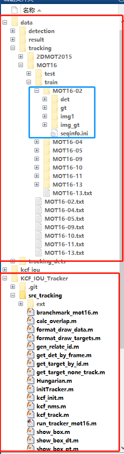
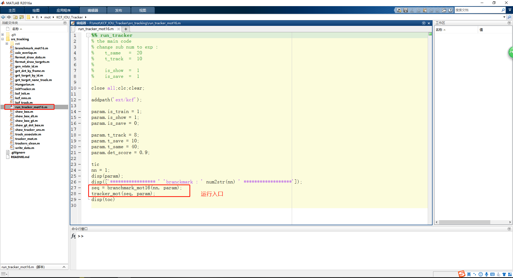

# 多目标追踪代码

## 1、项目说明

代码涉到大量脚本与数据集，由于仓库容量有限，数据和结果文件并未上传，可能会导致程序运行失败。

如果想要程序正常运行需要配置 branchmark_mot16.m 文件中的路径

持续整理中......

## 2、运行代码的正确步骤

### 2.1、文件目录

将数据文件按照如下结构部署，可以免去修改 branchmark_mot16.m 中的路径

```bash
|--data
   |--tracking
      |--MOT16
         |--train
            |--MOT16-02
               |--det
               |--gt
               |--img1
|--KCF_IOU_Tracker
   |--src_tracking
      |--run_tracker_mot16.m
```

#### 图例

红色框分别表示代码块与数据块。蓝色框为真正获取数据的位置。



### 2.2、运行入口



## 3、说明

- master分支：仅为demo演示
- backup分支：是最全面的分支，包括绘图、数据分析等代码
